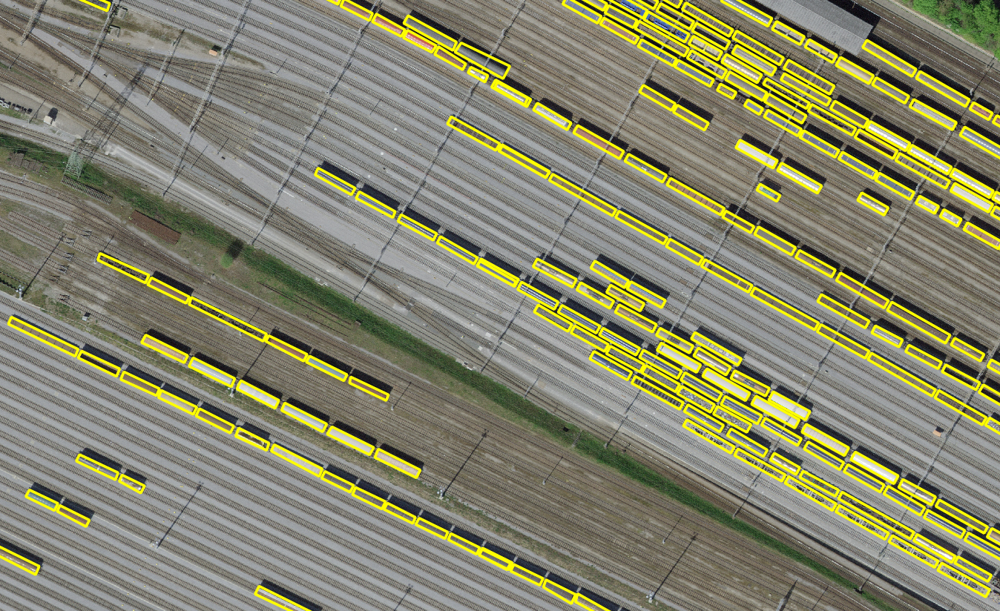
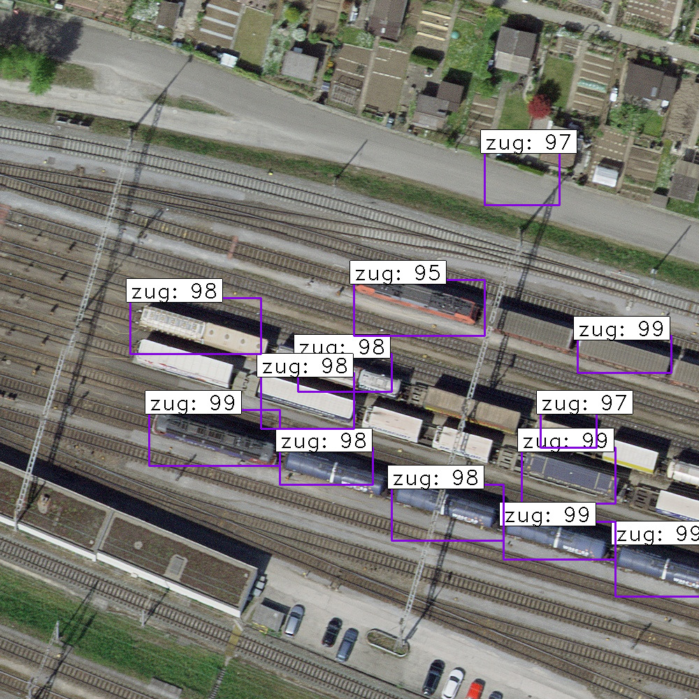
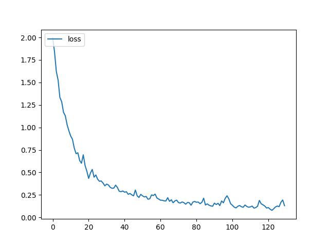
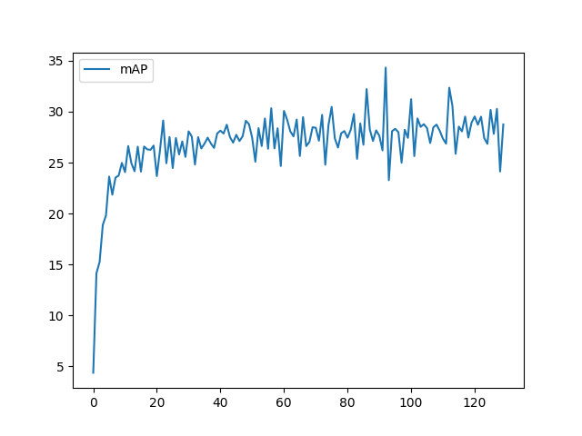

# train-detection
Detection of trains in SWISSIMAGE imagery for Analysis of High Resolution Imagery Class (WWU Münster)

## Introduction

In a world where the climate crisis is becoming increasingly pressing, societies need to transition to greener modes of transportation. In particular, public transport provides an important opportunity to reduce traffic related emissions. In Switzerland, an index of public transport quality is publicly available. In this study, we aim to compare CNN train detections on aerial imagery to this index. We do this in a way that allows reproducibility and consequently, a notion of public transport quality can be computed elsewhere too. 

### Data

The [swisstopo open data portal](map.geoadmin.ch) provides high resolution RGB imagery covering the entire geographic area of Switzerland, with a temporal coverage of 2018 until recently. These images are called [SWISSIMAGE](https://www.swisstopo.admin.ch/de/geodata/images/ortho/swissimage10.html) and can be obtained with 10 cm resolution in either .tif format or through a WMS. 

For this study, we focussed on the municipality of Muttenz. As has been said, imagery is already available. In order to detect trains, labels that indicate train presence in the imagery are also required to train the model. In this case, our base label dataset is a combination of manually produced labels, and others made by colleagues. This vector file can be found [here](trains-data/vehicles-labels.geojson). The image below gives an impression of this dataset, where it is displayed overlaying the local SWISSIMAGE from 2018. 



## The Model

For this task we developed a Faster Recurrent-Convolutional Neural Network (Faster R-CNN) using ResNet as backbone model. Our code was primarily based on [Rawat's implementation for Airplanes detection](https://github.com/ShubhankarRawat/Airplane-Detection-for-Satellites) with some hyperparameter tuning that seemed optimal for this particular context, including a whole lot of data preparation. All these scripts can be found [here](src/) too. 

If you want to check our hyperparameters in more detail, we invite you to have a look at [this file](src/keras_frcnn/config.py), and also [this one](src/keras_frcnn/resnet.py). This also illustrates the implemented architecture. It does not deviate much from the classic f-RCNN architecture, as, e.g., the one proposed by [Xu](https://towardsdatascience.com/faster-r-cnn-object-detection-implemented-by-keras-for-custom-data-from-googles-open-images-125f62b9141a). 

## Comparison to Public Transport Quality Data

As aforementioned, the goal of this study is to compare the amount of detected trains to the [Public Transport Connection Quality ARE from swisstopo](https://www.are.admin.ch/verkehrserschliessung). For that reason, we applied a simple spatial query comparing these polygons to the locations of the detected trains in a buffer area of 100 m around [swiss railways](https://www.bav.admin.ch/bav/de/home/verkehrstraeger/eisenbahn.html). This is done with [wms-extractor code](src/wms-extractor.py), which also clips the WMS from swisstopo in 100 m images for predictions. Something similar is done with the input images (downloaded from [here](https://www.swisstopo.admin.ch/en/geodata/images/ortho/swissimage10.html#musterdaten) with [this code](src/Files.py).

The detections are delivered in two ways: first of all, every prediction image is overplotted by the predicted bounding boxes and labels. Secondly, a [csv](bounding_box_coordinates_ans.csv) with the bounding box pixel coordinates is given, paired with every image filename. A script to extract these coordinates to their centroid into a [geojson file](trains-data/detected-centroids.geojson) is available [here](src/extract-centroids.R).   

## Hardware
 
We ran our model and its tests in the HPC from the University of Münster [PALMA](https://www.uni-muenster.de/CoCoS/Systeme/PALMA.html) using the GeForce RTX 2080, and mainly GeForce RTX Titan. Local tests were performed with NVIDIA Quadro RTX as well.

## Results



We obtained a classifier accuracy for bounding boxes from RPN of 97.6 %. The loss and mAP curves were implemented for validation purposes as seen in the following graph:



The mAP can also be observed below:



plot of quality vs. centroids

correlation plot

## Usage

Please be aware that older versions of tensorflow (1.15.0) and keras (2.0.3) were used, so be careful with the installation. Instructions are given in the following paragraph. 

The python version used was 3.7.13, this was chosen due to tensorflow and keras compatibility. To get started, you create an environment in conda, for example like this:

```
$ conda create -n <envname> python=3.7.13
```

Below you can see how the tensorflow-gpu was installed, which automatically installs all other requirements for tensorflow. If you're not using a GPU, try tensforflow==1.15.0, but be careful - it will take long and some troubleshooting with conda may still be necessary. As a final step, keras was installed, which is another group of packages.
 
```
$ conda install tensorflow-gpu==1.1.5.0
$ pip install keras==2.0.3
$ pip install h5py==2.10.0
$ pip install opencv-python==4.6.0.66
$ pip install matplotlib==3.5.2
# pip install pandas==1.3.5
``` 

You can also try $ pip install -r requirements.txt , but we do not recommend doing so, as the order of installation was essential to make this environment work as desired. 

Once the the environment is ready, make sure to verify that all files are in the correct directory. Our training images were in a directory called training_images. If you're using our annotation file, and exectung exactly as we did, then you can simply run the following code chunck to train the model:

```
$ python src/train_frcnn.py -o simple -p src/annotation.txt --input_weight_path weights/resnet50_weights_tf_dim_ordering_tf_kernels.h5 --num_epochs 130
```

Once you trained the model, the mAP and loss related files can be accessed. As a next step, run the following command to create a folder where the prediction will be made on. 

```
$ mkdir results_imgs
```

Our prediction images were in a directory called tst-img, therefore, we ran this command to make predictions:

```
$ python src/test_frcnn -p tst-img/
```

After following these steps, you should have obtained the images and the final csv with the detection results. 

## References

[Faster R-CNN Explained](https://medium.com/@smallfishbigsea/faster-r-cnn-explained-864d4fb7e3f8)

[Faster R-CNN (object detection) implemented by Keras for custom data from Google’s Open Images Dataset V4](https://towardsdatascience.com/faster-r-cnn-object-detection-implemented-by-keras-for-custom-data-from-googles-open-images-125f62b9141a)

[Airplanes Detection for Satellite using Faster RCNN](https://towardsdatascience.com/airplanes-detection-for-satellite-using-faster-rcnn-d307d58353f1)

### Contact

Please don't hesitate to reach us if you have any doubts:

huriel.reichel@protonmail.com / huriel.reichel@uni-muenster.de
